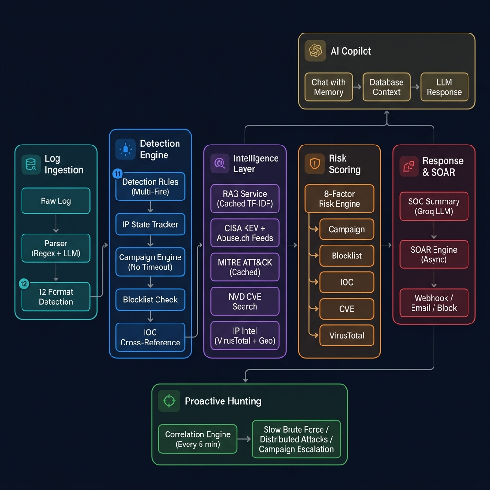
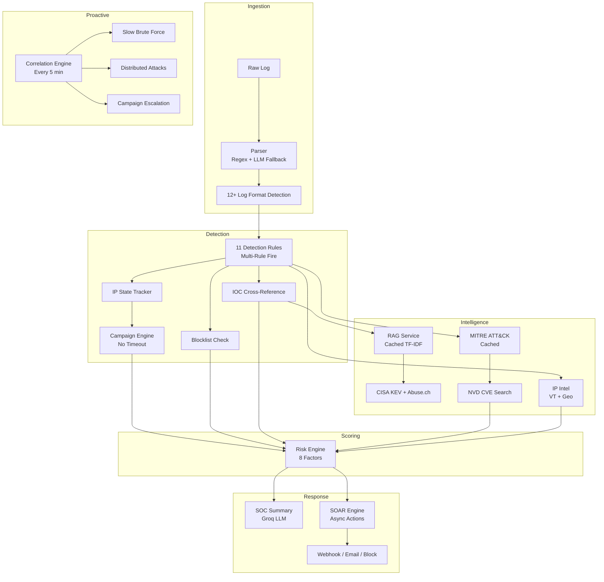

# ThreatLens v2.1 — Complete Feature Documentation

> **AI-Powered Security Intelligence Platform**
> Stack: FastAPI + MySQL + Groq LLM + MITRE ATT&CK + CISA/Abuse.ch Threat Feeds

---

## Architecture Overview

---

## Module 1: Intelligent Log Parsing

### Feature 1: Hybrid Log Parser (Regex + AI Fallback)
| | |
|---|---|
| **Files** | `services/parser.py`, `services/llm_service.py` |
| **What it does** | Extracts 9 structured fields from any raw log: `source_ip`, `dest_ip`, `event_id`, `user`, `status`, `log_type`, `process`, `port`, `hostname`. |
| **How it works** | First pass uses purpose-built regex extractors for each field. If both `source_ip` and `event_id` are missing (indicating an unstructured format), it falls back to the Groq LLM to dynamically parse the log. The LLM fallback is wrapped in `try/except` so failures never crash the pipeline. |
| **What makes it unique** | Most SIEM parsers are regex-only and fail silently on unknown formats. ThreatLens uses AI as a **safety net** — if regex can't parse it, the LLM understands it contextually. This means the system can handle logs it's never seen before. |

### Feature 2: 12-Format Log Type Classification
| | |
|---|---|
| **File** | `services/parser.py` (lines 30-56) |
| **What it does** | Automatically classifies incoming logs into one of 12 categories: `windows`, `linux`, `cisco`, `palo_alto`, `ids_ips`, `firewall`, `aws_cloudtrail`, `azure`, `gcp`, `web_server`, `dns`, `syslog`. |
| **How it works** | Uses an ordered list of compiled regex patterns. Vendor-specific patterns (Cisco `%ASA-`, Palo Alto `TRAFFIC`) are checked before generic ones (firewall `iptables`) to prevent false matches. |
| **What makes it unique** | The ordering is critical — most parsers would misclassify a Cisco ASA log as a generic firewall log. ThreatLens uses priority-based pattern matching to ensure vendor-specific identification always wins. |

---

## Module 2: Multi-Rule Detection Engine

### Feature 3: 11-Rule Detection with Multi-Fire
| | |
|---|---|
| **File** | `services/detector.py` (lines 146-251) |
| **What it does** | Runs every incoming log against 11 detection rules covering the full MITRE ATT&CK kill chain. **All** matching rules fire — not just the first match. |
| **Rules** | Successful Login After Brute Force, Brute Force Attack, Suspicious PowerShell, Credential Dumping (Mimikatz/LSASS), Event Log Cleared, Lateral Movement (PsExec/WMI), Data Exfiltration, Persistence (schtask/crontab), Reconnaissance (nmap/masscan), Privilege Escalation, C2 Communication. |
| **How it works** | Each rule is a lambda function that receives the parsed log and the IP's historical state. All 11 rules are evaluated, and every match is collected. The highest-confidence match becomes the "primary" threat, but all detected stages, MITRE techniques, and threat names are returned. |
| **What makes it unique** | Traditional SIEM rules use `if/elif` chains where only the first matching rule fires. A log containing both PowerShell and Mimikatz would only trigger "PowerShell" in those systems. ThreatLens fires both, reporting compound threats like `["Suspicious PowerShell Execution", "Credential Dumping Attempt"]` — which is far more useful for SOC analysts. |

### Feature 4: Successful Login After Brute Force Detection
| | |
|---|---|
| **File** | `services/detector.py` (lines 147-158) |
| **What it does** | Detects when a successful login occurs from an IP that has 3+ prior failed login attempts. This is the single most dangerous signal in security — it means the attacker **got in**. |
| **How it works** | The detector checks `ip_state.failed_logins >= 3` combined with `parsed.status == "Success"`. When triggered, it sets a `severity_override: CRITICAL` that forces the risk engine to score 90+, regardless of other factors. |
| **What makes it unique** | Most brute force detectors only alert on the failed attempts themselves. They miss the critical moment when the attacker actually succeeds. ThreatLens treats this as the highest-priority detection rule (confidence: 0.95) and auto-escalates it to CRITICAL with a severity override. |

### Feature 5: Campaign-Based Multi-Stage Tracking
| | |
|---|---|
| **File** | `services/detector.py` (lines 76-140) |
| **What it does** | Groups related attack events into persistent campaigns. If IP `203.0.113.99` does a brute force on Monday and returns with PowerShell on Friday, both events are linked to the same campaign. |
| **How it works** | When a threat is detected, the system searches for existing Active/Dormant campaigns involving the same IP. If found, the new stage is appended to the campaign's `stages_progression` array. If not, a new campaign is created. Campaigns **never time out** — they stay until manually closed, and reactivate from "Dormant" on new activity. |
| **What makes it unique** | Traditional SIEMs use session-based windowing (e.g., "group events within 30 minutes"). APT actors deliberately spread attacks across days/weeks to defeat this. ThreatLens campaigns are **indefinite** — a brute force from January and a lateral movement from March will be correctly linked. |

### Feature 6: Multi-Stage Attack Chain Correlation
| | |
|---|---|
| **File** | `services/detector.py` (lines 253-267) |
| **What it does** | Detects when a campaign has progressed through known attack chain patterns, such as `Initial Access → Execution → Credential Access` (Full Kill Chain). |
| **How it works** | 12 predefined attack chains are checked against the campaign's accumulated stages using `set.issubset()`. The longest matching chain wins. Detection boosts confidence by `+0.10 * chain_length`, and the warning (e.g., "Complete APT Chain Detected") is included in the response. |
| **What makes it unique** | This is behavioral correlation — it doesn't just detect individual events, it recognizes **patterns of progression**. A 4-stage APT chain detection carries far more weight than 4 isolated alerts. |

### Feature 7: Time-Decay Threat Scoring
| | |
|---|---|
| **File** | `services/detector.py` (lines 20-33) |
| **What it does** | Applies an exponential decay weight to historical IP data, so recent events carry more weight than old ones. |
| **How it works** | Uses the formula `weight = e^(-0.003 * hours_ago)`, producing: 1 hour ago → 1.0, 1 day → 0.8, 1 week → 0.5, 1 month → 0.2, 3 months → 0.1. The weight is never zero — historical data always contributes. |
| **What makes it unique** | Most systems use a binary cutoff (e.g., "ignore events older than 7 days"). Time-decay preserves historical context while naturally prioritizing recent activity. An IP that attacked 2 months ago still raises a flag — just a smaller one. |

---

## Module 3: Comprehensive Risk Engine

### Feature 8: 8-Factor Risk Scoring
| | |
|---|---|
| **File** | `services/risk_engine.py` |
| **What it does** | Computes a 0-100 risk score using 8 independent factors, each contributing a bounded number of points. |
| **Factors** | 1. Detection confidence (0-50 pts), 2. Time-decay adjustment (-5 to 0), 3. Campaign stage count (0-30 pts), 4. Multi-stage chain correlation (+15), 5. Highest CVSS from CVE matches (0-20 pts), 6. VirusTotal reputation (0-30 pts), 7. Blocklist status (+25), 8. Threat intel IOC matches (0-20 pts), 9. Failed login count (0-15 pts). |
| **Classification** | >= 80 = CRITICAL, >= 55 = HIGH, >= 30 = MEDIUM, < 30 = LOW |
| **What makes it unique** | Every factor is explained in the response's `risk_factors` array. A SOC analyst can see exactly *why* an event scored 85 — e.g., `["Detection confidence: 95% (+48)", "Campaign: 3 stages (+30)", "IP is on BLOCKLIST (+25)"]`. Full transparency, no black boxes. |

---

## Module 4: Threat Intelligence Pipeline

### Feature 9: Real-Time Threat Feed Ingestion
| | |
|---|---|
| **File** | `services/threat_intel_ingestion.py` |
| **What it does** | Fetches and stores IOCs from 3 real government/community threat intelligence feeds into MySQL. |
| **Feeds** | **CISA KEV** (Known Exploited Vulnerabilities — CVEs actively used in the wild), **Abuse.ch Feodo Tracker** (Botnet C2 IP addresses), **Abuse.ch URLhaus** (Malicious URLs). |
| **What makes it unique** | These aren't mock feeds — they're the same sources used by Fortune 500 SOCs. ThreatLens automatically deduplicates entries and stores raw data for deep investigation. The system currently holds 101+ IOCs that are actively cross-referenced against incoming logs. |

### Feature 10: Automatic IOC Cross-Referencing on Ingestion
| | |
|---|---|
| **Files** | `routers/analysis.py` (lines 51-60), `services/rag_service.py` (`check_ioc_match`) |
| **What it does** | Every log that enters the system has its source IP automatically checked against the threat intel database. If the IP matches a known botnet C2, the log is immediately flagged — even if no detection rule fires. |
| **How it works** | `check_ioc_match(ip, db)` performs an exact-match query against `threat_intel.ioc_value` where `ioc_type == "ip"`. If a match is found and no detection rule triggered, the system force-creates a detection with `confidence: 0.85` and sets risk to HIGH minimum. |
| **What makes it unique** | Most analysis tools only check rules. ThreatLens checks **intelligence** — if a log comes from a CISA-listed botnet IP, the system catches it even if the log content looks completely benign. |

### Feature 11: Cached RAG Threat Intelligence Retrieval
| | |
|---|---|
| **File** | `services/rag_service.py` |
| **What it does** | Retrieves contextually relevant threat intelligence for any detected threat using a dual-strategy search. |
| **Strategies** | **Direct IOC Match**: Exact string match against IOC values. **Semantic TF-IDF Search**: Vectorizes the threat description and compares it against all stored intel using cosine similarity. Falls back to a built-in knowledge base if the DB is empty. |
| **Performance** | The TF-IDF matrix is cached in memory and only rebuilt when the intel entry count changes. This avoids rebuilding a matrix from 500+ documents on every API call. |
| **What makes it unique** | Combining exact-match IOC lookup with semantic similarity search gives the best of both worlds — precision for known indicators and recall for novel but related threats. |

### Feature 12: Blocklist Enforcement
| | |
|---|---|
| **Files** | `routers/analysis.py` (lines 44-49), `routers/alerts.py` |
| **What it does** | Every incoming log has its source IP checked against the blocklist. Blocked IPs are auto-escalated to CRITICAL (score 95+) regardless of what the log contains. Analysts can manually block/unblock IPs via API. |
| **What makes it unique** | The blocklist is bidirectional — it can be populated manually by analysts or automatically by SOAR rules. And it's **enforced** — not just a list, but an active gate in the analysis pipeline. |

---

## Module 5: SOAR Automation & Alerting

### Feature 13: Configurable SOAR Alert Rules
| | |
|---|---|
| **Files** | `services/alert_service.py`, `routers/alerts.py` |
| **What it does** | A fully configurable rule engine that evaluates new incidents against user-defined conditions and executes automated actions. |
| **Condition Types** | `risk_level` (exact match), `risk_level_min` (threshold), `threat_type` (substring match), `multi_stage` (campaign correlation). |
| **Action Types** | `webhook` (Slack/Teams/custom), `email` (SMTP), `block_ip` (auto-blocklist), `escalate` (change incident status). |
| **What makes it unique** | Rules are fully CRUD-managed via API. Users can create custom rules like "If threat_type contains 'credential dumping', auto-block the IP and send a Slack alert." The system ships with 4 pre-configured rules. |

### Feature 14: Async Webhook Notifications with Auth
| | |
|---|---|
| **File** | `services/alert_service.py` (`_send_webhook`) |
| **What it does** | Sends Slack-formatted webhook notifications to any URL. Supports custom `auth_headers` and `bearer_token` for enterprise integrations (Jira, PagerDuty, etc.). |
| **How it works** | Webhooks fire in **daemon threads** — they never block the analysis pipeline. If the target server is slow or down, log processing continues unaffected. |

### Feature 15: SMTP Email Alerts
| | |
|---|---|
| **File** | `services/alert_service.py` (`_send_email`) |
| **What it does** | Sends styled HTML email alerts via SMTP with severity-colored formatting. Supports Gmail, Outlook, and custom SMTP servers. |
| **How it works** | Uses Python's `smtplib` with TLS. Emails fire in daemon threads. SMTP credentials are configured in `.env` (`SMTP_USER`, `SMTP_PASSWORD`). Each email includes threat type, severity, source IP, MITRE technique, and incident ID. |

---

## Module 6: AI SOC Copilot

### Feature 16: RAG-Powered SOC Chat with Memory
| | |
|---|---|
| **Files** | `services/chat_service.py`, `routers/chat.py` |
| **What it does** | A natural language interface where SOC analysts can ask questions like "What IPs have been brute forcing us this week?" or "Show me all campaigns targeting the admin account." |
| **How it works** | The system intelligently gathers database context based on the question (IP lookups, incident queries, campaign data, blocklist status), injects it into the LLM prompt, and returns a professional analyst-grade response. |
| **Memory** | The copilot loads the last 10 chat messages from the same `session_id` and injects them into the LLM prompt. This enables multi-turn conversations: "Show critical incidents" → "Tell me more about the first one" → "Block that IP." |
| **What makes it unique** | This isn't a generic chatbot — it's a database-aware AI analyst. It queries your actual MySQL tables (incidents, campaigns, IP states, blocklist) to give answers grounded in real data. The session-based memory makes it conversational, not one-shot. |

---

## Module 7: Proactive Threat Hunting

### Feature 17: Background Correlation Engine
| | |
|---|---|
| **File** | `services/correlation_engine.py` |
| **What it does** | Runs every 5 minutes as a background job to hunt for threats that single-log analysis cannot detect. |
| **Detections** | **Slow Brute Force**: 5+ failed logins spread over 12+ hours (evades real-time thresholds). **Distributed Brute Force**: 3+ different IPs targeting the same user account. **Multi-Stage Escalation**: Auto-promotes campaigns with 3+ stages to CRITICAL. **Dormant Campaign Management**: Marks campaigns inactive after 48h; reactivates on new activity. **Auto-Block Repeat Offenders**: IPs with 10+ failed logins and 2+ attack stages are auto-added to the blocklist. |
| **What makes it unique** | Most SIEMs are reactive — they only analyze logs as they arrive. ThreatLens proactively sweeps the database every 5 minutes looking for patterns that emerge over time. An attacker spreading 1 login attempt per hour across 3 days would be invisible to real-time detection but caught by the correlation engine. |

---

## Module 8: Observability & Operations

### Feature 18: Async Bulk Log Ingestion with Job Tracking
| | |
|---|---|
| **File** | `routers/analysis.py` (lines 147-240) |
| **What it does** | The `/ingest` endpoint accepts arrays of logs and processes them **asynchronously**. Returns immediately with a `job_id`, then processes in a background thread in batches of 50. |
| **How it works** | `POST /ingest` → returns `{status: "accepted", job_id: "abc123"}`. `GET /ingest/status/abc123` → returns `{status: "processing", logs_processed: 35, total_logs: 100, incidents_created: 5}`. |
| **What makes it unique** | The endpoint won't time out on large payloads. Each batch of 50 logs gets its own DB commit, so partial progress is saved even if the job fails midway. |

### Feature 19: Health Endpoint with Metrics
| | |
|---|---|
| **File** | `main.py` (lines 168-187) |
| **What it does** | `GET /health` returns operational metrics: uptime, total requests, error rate, scheduler status, last correlation sweep time, and findings count. |
| **Middleware** | A request metrics middleware tracks all HTTP requests, counts errors, and logs warnings for requests slower than 5 seconds. |

### Feature 20: IP Investigation & Attack Timeline
| | |
|---|---|
| **File** | `routers/dashboard.py` |
| **What it does** | Two investigation endpoints: `/investigate/{ip}` returns the complete dossier on an IP (login history, stages, campaigns, incidents, recent logs). `/timeline/{ip}` returns a chronological merged view of all logs and incidents for visual attack reconstruction. |
| **What makes it unique** | The timeline merges two separate data streams (raw logs + analyzed incidents) into a single chronological narrative, making it easy to see exactly how an attack progressed from reconnaissance to exfiltration. |

---

## API Surface Summary

| Endpoint | Method | Purpose |
|---|---|---|
| `/api/v1/analysis/analyze` | POST | Full single-log analysis pipeline |
| `/api/v1/analysis/ingest` | POST | Async bulk ingestion (returns job_id) |
| `/api/v1/analysis/ingest/status/{id}` | GET | Check bulk ingestion progress |
| `/api/v1/logs/parse` | POST | Parse-only (no detection/scoring) |
| `/api/v1/dashboard/stats` | GET | Aggregate SOC dashboard statistics |
| `/api/v1/dashboard/incidents` | GET | Paginated incident list with filters |
| `/api/v1/dashboard/incidents/{id}` | GET/PUT | Get or update incident status |
| `/api/v1/dashboard/logs` | GET | Log history with filters |
| `/api/v1/dashboard/investigate/{ip}` | GET | Full IP investigation dossier |
| `/api/v1/dashboard/timeline/{ip}` | GET | Chronological attack timeline |
| `/api/v1/dashboard/campaigns` | GET | List all campaigns |
| `/api/v1/dashboard/campaigns/{id}` | GET | Campaign detail with incidents |
| `/api/v1/dashboard/campaigns/{id}/close` | PUT | Close a campaign |
| `/api/v1/dashboard/correlate` | POST | Manually trigger correlation sweep |
| `/api/v1/chat/ask` | POST | AI SOC Copilot (with memory) |
| `/api/v1/chat/history` | GET | Chat history (filterable by session) |
| `/api/v1/alerts/rules` | GET/POST | List or create alert rules |
| `/api/v1/alerts/rules/{id}/toggle` | PUT | Enable/disable a rule |
| `/api/v1/alerts/rules/{id}` | DELETE | Delete a rule |
| `/api/v1/alerts/blocklist` | GET/POST | View or add to blocklist |
| `/api/v1/alerts/blocklist/{id}` | DELETE | Unblock an IP |
| `/api/v1/alerts/intel/ingest` | POST | Trigger threat intel feed refresh |
| `/api/v1/alerts/intel/stats` | GET | Threat intel database statistics |
| `/api/v1/mitre/technique/{id}` | GET | MITRE ATT&CK technique lookup |
| `/health` | GET | Health check with metrics |
| `/docs` | GET | Swagger UI |

**Total: 26 production-ready endpoints across 6 routers.**
